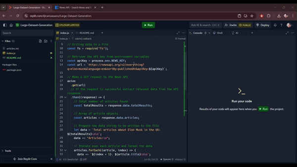
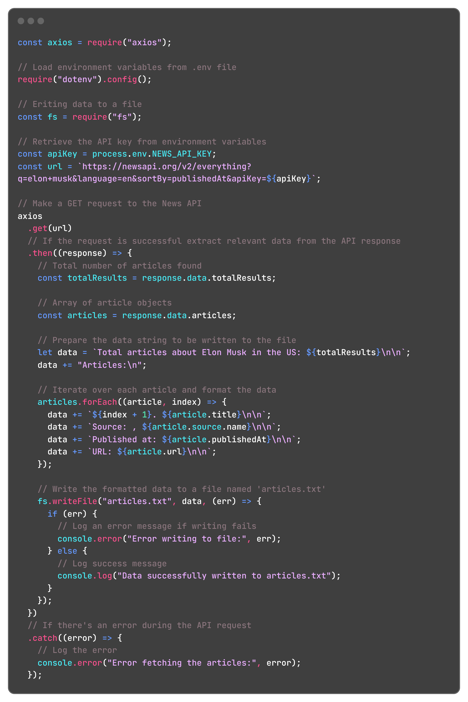
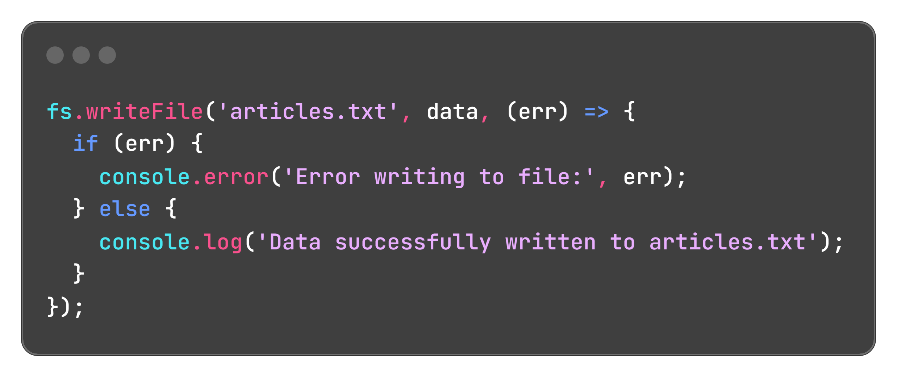
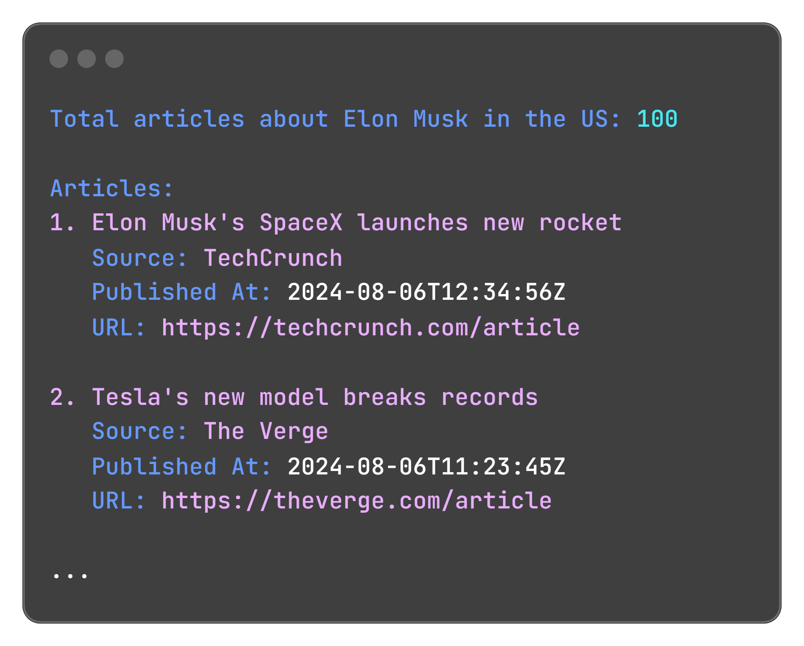

<h1 align="center">Large Dataset Generation</h1>

Provides a script to generate a large dataset from a News API using Node.js. The script fetches data from the API, formats it, and writes it to a text file.

## Table of Contents

- [Introduction](#introduction)
- [API Details](#api-details)
- [Script Explanation](#script-explanation)
  - [Fetching Data](#fetching-data)
  - [Writing Data to File](#writing-data-to-file)
- [Running the Script](#running-the-script)
- [Example Output](#example-output)
- [Prerequisites](#prerequisites)
- [Setup](#setup)
  - [Cloning the Repository](#cloning-the-repository)
  - [Installing Dependencies](#installing-dependencies)
  - [Environment Variables](#environment-variables)
- [Technologies](#technologies)
- [Project Structure](#project-structure)
- [Author](#author)
- [Contact](#contact)

## Introduction

This project demonstrates how to generate a large dataset by fetching data from an API and exporting it to a text file. It uses the News API to gather articles about a specific topic and store the results in a `.txt` file.

## API Details
Used the [News API](https://newsapi.org/) to fetch the latest news articles. Here are the details:
- Endpoint:
  `https://newsapi.org/v2/everything`
- Parameters:
  - `q`: The query keyword (e.g., Elon Musk)
  - `language`: The language of the articles (e.g., en for English)
  - `sortBy`: The sorting criteria (e.g., publishedAt for the most recent articles)
  - `apiKey`: Your News API key

## Script Explanation
### **Fetching Data**
The script uses the axios library to fetch data from the News API.


### **Writing Data to File**
The fetched data is formatted and written to a .txt file using the fs (File System) module:



## Running the Script
To run the script and generate your dataset, use the following command:
``node index.js
``

## Example Output
After running the script, you will find `articles.txt` in the root directory with content similar to:


## Prerequisites
Before you begin, ensure you have the following installed:
  - [Node.js](https://nodejs.org/) installed.
  - News API Key (You can get one from [News API](https://newsapi.org/)

## Setup

### **Cloning the Repository**
1. First, clone this repository to your local machine:
`` git clone https://github.com/yourusername/large-dataset-generation.git ``
`` cd large-dataset-generation ``
### **Installing Dependencies**
2. Install the required Node.js packages:
`` npm install axios dotenv ``
### **Environment Variables**
3. Create a `.env` file in the root directory of the project and add your News API key:
   - `npm i dotenv`
   - Add the following line to the `.env` file:
     `NEWS_API_KEY=your_news_api_key_here`
     
## Technologies
This project uses the following technologies:
- **Replit:** For online coding and development
- **Node.js:** JavaScript runtime environment
- **JavaScript:** Programming language used for the script
- **axios:** Promise-based HTTP client for making API requests

## Project Structure
```
large-dataset-generation
├── index.js          
├── README.md         
├── articles.txt      
├── .env              
├── images              
│   └── example.output.png
│   └── fetch.data.png
│   └── writing.data.png
└── video              
    └── generate_data.gif
            

```

## Author
**Carisa Saenz-Videtto**

## Contact
carisasaenz@gmail.com
